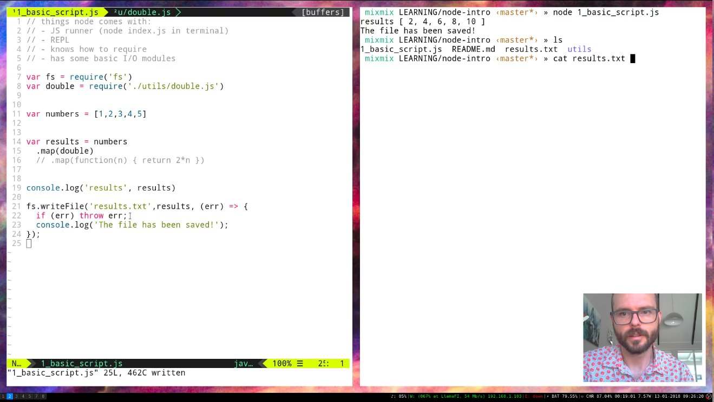

# Node Intro

_based on a Twitch stream I'm doing / did_

https://youtu.be/N9yURqYtXTQ

For the stream: 
- Stream location: https://www.twitch.tv/mixmixjellyfish/
- Notes during the video : https://hackmd.io/EYJgpg7ArAxmAcBaAnGAJsRAWCIKIEMoQZEAGAgRhjSgDZ4sqQg=#

repo: 
  - ssb: %RQRdvrMM66kAScjCRdmXP0+6GCFkWpYIo2gN1dinax8=.sha256
  - github: github.com/mixmix/node-intro

Check out a wide range of scuttlebutt learning resources here : **scuttlebutt-guide** ([ssb](%rRmgg8grYJ/upfXKxFNG62Y49CmkEShk70HoFLIEyDY=.sha256) | [github](https://github.com/ssbc/scuttlebutt-guide))

## Topics

- What is Node?
  - require + export
  - REPL
  - how best to install Node (NVM)

- What is NPM?
  - installing and using module
    - what's a good module?
  - that `package.json` file
    - dependencies
    - scripts
    - version / name
  - publishing modules

- Writing tests
  - a brief `tape` demo

## Introductions 

who's in this stream?
Where are based, what's your code background

`@mixmix` : I'm in Wellington, New Zealand, I've got 5-6 years programming experience. I came from a maths degree, did a few years Ruby/Rails, have been using and teaching NodeJS for ~2years

`@mycognosist` : Near Cape Town, South Africa. Have been writing Python for about 14 months now, primarily writing web apps with Flask. Am now learning React and have also done some basic Rust coding. New to Node. Background as an environmental anthropologist, now focusing on fungi, permaculture and code.

`@rinchen`: Boulder, Colorado. Started programming in the 1990s but became an project manager. Light experience with C, Python, and 5 or 6 other languages. Learning Javascript presently for fun (and to help my son with his programming assignments at school). :-)

@moid: Ct. US new node programmer - goal is to learn enough of SSB internals to understand how well it does as a P2P system, and how I can help

[@lancew](ssb://@W87GwaaxNj0PSBbtc5qUm/A/xOO8AWPdNtJn6hzR8s0=.ed25519) : Southampton, UK (but a kiwi). Fulltime Perl web developer. So some frontend JS and some node but not much. Some PHP in there too. And because I amlike a challenge... Perl6.  https://github.com/lancew and @W87GwaaxNj0PSBbtc5qUm/A/xOO8AWPdNtJn6hzR8s0=.ed25519 on ScuttleButt

[Fabián Heredia in SSB](ssb://@k53z9zrXEsxytIE+38qaApl44ZJS68XvkepQ0fyJLdg=.ed25519): Mexico City, Mexico. Math student at UNAM. Saw this stream in SSB and I am interested in learning a bit of JS/Node to contribute to SSB/Patch- projects. Some python/ruby/haskell/r experience :)

`@craigambrose`: Melbourne, Australia. 20 years programming experience. Lots of ruby particularly. Am currently promoting and teaching JavaScript at my company, but while I've been doing React/Redux and front end JS for the last two years, my use of Node has been limited to a couple of simple scripts. I've never done server side JS for a web app for example. Never done electron either.

@melody here from Auckland. Done a bunch of projects using Arduino, Max msp. Started learning AngularJS but stayed on the front end side because it made more sense to me. Ill prob watch this video about 6 times.

## Requests

.....
Can someone pull some bullet-points over from scuttlebutt about what people were requesting while I get ready

- [ ] how does this look in Patchwork?
- [x] How does local/global scoping of the modules work? (moid)
    - How are name clashes resolved?
- [x] linting (eslint etc Rinchen)
- [x] Workflow for hacking on dependencies locally? ie. packages and node paths (moid)
- [x] How to do basic package management? ie. upgrading/downgrading/listing packages
- [x] How to find and select trusted modules?
- [x] Do node developers typically use ES6 (ES2015), babel, etc?

... add more here ^^
- [x] Are there seperate client & server processes in Electron? Is only one of them node?

## Links

- [Scuttlebutt learning!](https://github.com/ssbc/scuttlebutt-guide)
- [Install Node](https://github.com/creationix/nvm)
- MDN e.g. search `mdn array js` > https://developer.mozilla.org/en-US/docs/Web/JavaScript/Reference/Global_Objects/Array
- [Node Packages](https://www.npmjs.com/)
- [Lodash (some nice js tools)](https://lodash.com/docs/4.17.4#map)
- [tape](https://npmjs.com/tape) and [tap-spec](npmjs.com/tap-spec) for testing

- https://nodejs.org/api/fs.html

